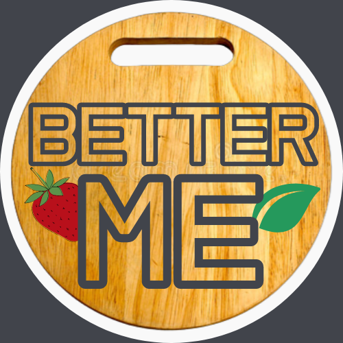

# Better Me

  
  
Aplikasi Resep Makanan Sehat

  
untuk memenuhi kebutuhan nutrisi

## About Team

ID Team : C22-242

Program : Front-End Web & React

Anggota Kelompok : 
+ R014X0110 - Benedict Kenjiro Lehot

## Backgrounder

Di zaman modern ini, banyak masyarakat yang menggemari makanan cepat saji, mulai dari anak-anak, remaja, hingga orang dewasa. Mereka mampu mengkonsumsi makanan cepat saji sebanyak 3 kali dalam sehari tanpa mengetahui atau mempedulikan kandungan nutrisi yang ada di dalam makanan tersebut. Bahkan, ada juga yang tidak ingin memakan makanan lain selain makanan cepat saji. Alhasil, penyakit atau gangguan seperti obesitas, masalah pencernaan, penyakit jantung, stroke, kanker, hingga diabetes kerap kita temukan pada masyarakat lansia bahkan remaja saat ini. 

_Better Me_ adalah sebuah aplikasi yang hadir dengan tujuan untuk menampilkan berbagai resep makanan sehat dan mencari resep makanan sehat sesuai takaran kalori yang dibutuhkan oleh tubuh. Pengguna dapat mencari resep makanan sesuai bahan-bahan yang dimiliki, sesuai takaran kalori, lemak, karbohidrat, hingga protein yang dibutuhkan. Selain itu, pengguna juga bisa mencari resep makanan tanpa memuat bahan-bahan yang menyebabkan alergi. 

Dengan adanya aplikasi ini, diharapkan dapat membantu menyelesaikan masalah dari penderita penyakit akibat makanan cepat saji. Manfaat dari aplikasi ini adalah agar pengguna dapat mengetahui :
1. Bagaimana cara membuat makanan sehat?
2. Bagaimana cara membuat makanan yang sesuai dengan target kalori yang ingin dicapai? 

Untuk menjawab pertanyaan tersebut, aplikasi Better Me menyediakan beberapa fitur, yaitu : 
1. _Recipe List_, di mana pengguna dapat melihat berbagai pilihan resep makanan yang disediakan. 
2. _Recipe Search_, di mana pengguna dapat melakukan pencarian dan pemfilteran resep berdasarkan nama resep, jumlah kalori, lemak, protein, dan karbohidrat yang dibutuhkan, berdasarkan bahan-bahan yang dibutuhkan, jenis resep (sarapan, makanan penutup, dll), berdasarkan diet (vegetarian, gluten free, dll), berdasarkan alergi atau pantangan (telur, kacang, makanan laut, dll), serta dapat mengurutkan resep tersebut berdasarkan kalori, lemak, atau protein. 
3. _Recipe Bookmark_, di mana pengguna dapat menyimpan resep yang diminati di dalam penyimpanan local pada web browser yang digunakan. 

## Deployed Link

https://better-me-242.netlify.app/

## Video Presentation

https://youtu.be/0e-qoMe-HZg

## Slide Presentation

https://drive.google.com/file/d/1Y5Z78RWCNFSMwe2cTZYyBMi0DW7uIZH-/view?usp=sharing 

## Video Demo

https://youtu.be/l6rggdaRv5g 
